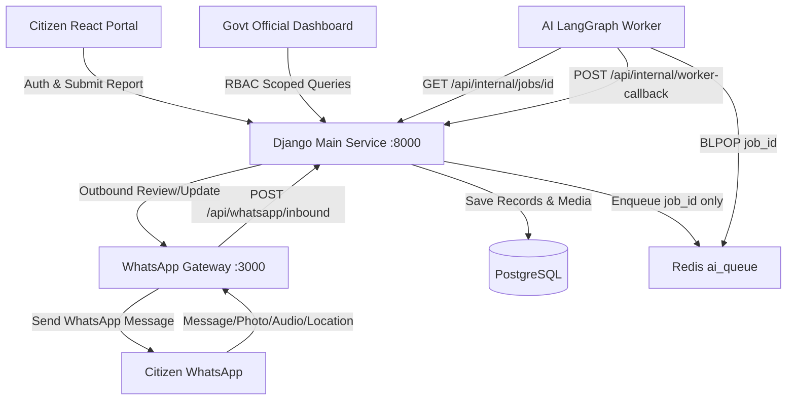

# Component Implementation Specification: Main Django Service & WhatsApp Gateway

**Project:** CWA Ship Karachi 2026 — Awaaz  
**Component:** Main Service (`main-service`) & WhatsApp Gateway (`whatsapp-service`)  
**Target Ports:** Main Service (`http://localhost:8000`), WhatsApp Gateway (`http://localhost:3000`)  
**Database:** PostgreSQL with `pgvector` (`localhost:5432`)  
**Message Broker:** Redis (`localhost:6379/0`)

---

## 1. Architectural Role & Responsibilities

The **Main Service** is the central authority of the system:
1. **Single Source of Truth for Data:** Owns and operates PostgreSQL. Neither the AI Worker nor the WhatsApp Gateway communicates with PostgreSQL directly.
2. **Citizen Authentication & Multi-Identity Management:** Handles citizen identity via National Identity Card (CNIC) as the primary key. Allows citizens to link multiple WhatsApp phone numbers to their core CNIC account.
3. **Role-Based Access Control (RBAC):** Enforces data boundaries for 4 roles: `CITIZEN`, `GOVT_OFFICIAL` (scoped to `KWSC`, `KMC`, `SSWMB`, or `CANTONMENT`), `SUPER_ADMIN`, and `AI_AGENT`.
4. **Job Buffer Pattern:** When a report is submitted (web or WhatsApp), Main Service writes media files to disk (`/media/`), creates a `JobBuffer` record, and pushes a lightweight job reference `{"job_id": "...", "created_at": "..."}` to Redis `ai_queue`.
5. **Dedicated Internal Worker APIs:** Exposes secure REST endpoints (`/api/internal/*`) for the AI Worker to pull batch jobs, fetch spatial boundaries, search active incidents for deduplication, and submit inference results.
6. **Government Admin Dashboard APIs:** Delivers department-scoped metrics, complaint feeds, evidence galleries, and status update workflows.

The **WhatsApp Gateway** (`whatsapp-service`) is an Express.js service wrapping the Baileys library:
1. Ingests incoming WhatsApp messages (text, photos, audio voice notes, location coordinates).
2. Forwards payloads to `POST /api/whatsapp/inbound` on the Main Service.
3. Exposes `POST /whatsapp/send` for outbound notifications dispatched by the system.



---

## 2. Database Models & Schema Design (`main-service`)

### 2.1 App: `users`

Implement in `users/models.py`:

```python
import uuid
from django.contrib.auth.models import AbstractUser
from django.db import models

class UserAccount(AbstractUser):
    ROLE_CHOICES = [
        ("CITIZEN", "Citizen"),
        ("GOVT_OFFICIAL", "Government Official"),
        ("SUPER_ADMIN", "Super Administrator"),
        ("AI_AGENT", "AI Worker Agent"),
    ]
    
    ORG_CHOICES = [
        ("KWSC", "Karachi Water & Sewerage Corporation"),
        ("KMC", "Karachi Metropolitan Corporation"),
        ("SSWMB", "Sindh Solid Waste Management Board"),
        ("CANTONMENT", "Cantonment Boards"),
    ]

    id = models.UUIDField(primary_key=True, default=uuid.uuid4, editable=False)
    cnic = models.CharField(max_length=15, unique=True, db_index=True, null=True, blank=True)
    primary_phone = models.CharField(max_length=20, unique=True, db_index=True, null=True, blank=True)
    role = models.CharField(max_length=20, choices=ROLE_CHOICES, default="CITIZEN")
    assigned_org = models.CharField(max_length=20, choices=ORG_CHOICES, null=True, blank=True)

    def get_dashboard_route(self):
        if self.role == "CITIZEN":
            return "/citizen/portal"
        elif self.role == "GOVT_OFFICIAL":
            return "/admin/dashboard"
        elif self.role == "SUPER_ADMIN":
            return "/admin/super"
        return "/citizen/portal"

class LinkedPhone(models.Model):
    """Allows linking secondary phone/WhatsApp numbers to a single CNIC UserAccount."""
    user = models.ForeignKey(UserAccount, on_delete=models.CASCADE, related_name="linked_phones")
    phone_number = models.CharField(max_length=20, unique=True, db_index=True)
    created_at = models.DateTimeField(auto_now_add=True)
```

### 2.2 App: `core`

Implement in `core/models.py`:

```python
import uuid
from django.db import models
from django.conf import settings

class JobBuffer(models.Model):
    """Holds unclustered, unreviewed citizen submissions."""
    STATUS_CHOICES = [
        ("QUEUED", "Queued in Redis"),
        ("PROCESSING", "AI Inference in Progress"),
        ("READY_FOR_REVIEW", "Review Package Ready"),
        ("CONFIRMED", "Confirmed by Citizen"),
        ("FAILED", "Processing Failed"),
    ]
    
    SOURCE_CHOICES = [
        ("web", "Web Portal"),
        ("whatsapp", "WhatsApp"),
    ]

    id = models.UUIDField(primary_key=True, default=uuid.uuid4, editable=False)
    job_id = models.CharField(max_length=64, unique=True, db_index=True)
    user = models.ForeignKey(settings.AUTH_USER_MODEL, on_delete=models.SET_NULL, null=True, blank=True)
    source = models.CharField(max_length=20, choices=SOURCE_CHOICES, default="web")
    raw_text = models.TextField(blank=True, default="")
    image_file = models.FileField(upload_to="complaints/images/", null=True, blank=True)
    audio_file = models.FileField(upload_to="complaints/audio/", null=True, blank=True)
    lat = models.FloatField(null=True, blank=True)
    lng = models.FloatField(null=True, blank=True)
    landmark_hint = models.CharField(max_length=255, null=True, blank=True)
    status = models.CharField(max_length=20, choices=STATUS_CHOICES, default="QUEUED")
    
    # Inferred data populated by worker callback
    inferred_category = models.CharField(max_length=100, null=True, blank=True)
    inferred_authority = models.CharField(max_length=50, null=True, blank=True)
    inferred_severity = models.CharField(max_length=10, null=True, blank=True)
    layman_summary = models.TextField(null=True, blank=True)
    draft_subject_en = models.CharField(max_length=255, null=True, blank=True)
    draft_body_en = models.TextField(null=True, blank=True)
    draft_body_ur = models.TextField(null=True, blank=True)
    statutory_citations = models.TextField(null=True, blank=True)
    
    created_at = models.DateTimeField(auto_now_add=True)
    updated_at = models.DateTimeField(auto_now=True)

class MasterIncident(models.Model):
    """Clustered, verified civic incident stacking multiple community reports."""
    AUTHORITY_CHOICES = [
        ("KWSC", "KW&SC"),
        ("KMC", "KMC"),
        ("SSWMB", "SSWMB"),
        ("CANTONMENT", "Cantonment"),
    ]
    
    SEVERITY_CHOICES = [
        ("P0", "P0 - Emergency / Critical Hazard"),
        ("P1", "P1 - Major Disruption"),
        ("P2", "P2 - Routine Maintenance"),
    ]
    
    STATUS_CHOICES = [
        ("PENDING", "Pending Department Action"),
        ("IN_PROGRESS", "Crews Dispatched / In Progress"),
        ("RESOLVED", "Resolved"),
    ]

    id = models.UUIDField(primary_key=True, default=uuid.uuid4, editable=False)
    tracking_id = models.CharField(max_length=32, unique=True, db_index=True)
    target_authority = models.CharField(max_length=20, choices=AUTHORITY_CHOICES)
    issue_category = models.CharField(max_length=100)
    severity = models.CharField(max_length=10, choices=SEVERITY_CHOICES, default="P1")
    official_status = models.CharField(max_length=20, choices=STATUS_CHOICES, default="PENDING")
    
    lat = models.FloatField(null=True, blank=True)
    lng = models.FloatField(null=True, blank=True)
    landmark = models.CharField(max_length=255)
    community_reports_count = models.PositiveIntegerField(default=1)
    
    first_reported_at = models.DateTimeField(auto_now_add=True)
    last_reported_at = models.DateTimeField(auto_now=True)

class Incident(models.Model):
    """Single citizen report linked to a MasterIncident cluster."""
    id = models.UUIDField(primary_key=True, default=uuid.uuid4, editable=False)
    master_incident = models.ForeignKey(MasterIncident, on_delete=models.CASCADE, related_name="reports")
    user = models.ForeignKey(settings.AUTH_USER_MODEL, on_delete=models.SET_NULL, null=True, blank=True)
    job_buffer = models.OneToOneField(JobBuffer, on_delete=models.SET_NULL, null=True, blank=True)
    created_at = models.DateTimeField(auto_now_add=True)

class ComplaintDossier(models.Model):
    """Formal statutory complaint document associated with a MasterIncident."""
    id = models.UUIDField(primary_key=True, default=uuid.uuid4, editable=False)
    master_incident = models.OneToOneField(MasterIncident, on_delete=models.CASCADE, related_name="dossier")
    statutory_citations = models.TextField()
    subject_en = models.CharField(max_length=255)
    body_en = models.TextField()
    body_ur = models.TextField()
    official_notes = models.TextField(blank=True, default="")
    created_at = models.DateTimeField(auto_now_add=True)
    updated_at = models.DateTimeField(auto_now=True)
```

---

## 3. Standard Response Envelope

All endpoints must return the standardized response structure:

```json
{
  "success": true,
  "data": { ... },
  "error": null
}
```
Or upon error:
```json
{
  "success": false,
  "data": null,
  "error": {
    "code": "INVALID_INPUT",
    "message": "Specific explanation"
  }
}
```

---

## 4. REST API Endpoints Specification

### 4.1 Authentication & Profile (`/auth/*`)

#### `POST /auth/register`
- **Permissions:** `AllowAny`
- **Request:**
  ```json
  {
    "cnic": "42101-1234567-1",
    "full_name": "Muhammad Ali",
    "primary_phone": "+923001234567",
    "password": "securepassword123"
  }
  ```
- **Response (`201 Created`):**
  ```json
  {
    "success": true,
    "data": {
      "user_id": "c83f12a9-91bc-4e20-80d1-0f4b360172e1",
      "cnic": "42101-1234567-1",
      "full_name": "Muhammad Ali",
      "primary_phone": "+923001234567",
      "role": "CITIZEN",
      "assigned_org": null,
      "dashboard_route": "/citizen/portal",
      "token": "<JWT_ACCESS_TOKEN>"
    },
    "error": null
  }
  ```

#### `POST /auth/login`
- **Permissions:** `AllowAny`
- **Request:** Accepts CNIC or phone as identifier.
  ```json
  {
    "identifier": "42101-1234567-1",
    "password": "securepassword123"
  }
  ```
- **Response (`200 OK`):**
  ```json
  {
    "success": true,
    "data": {
      "user_id": "c83f12a9-91bc-4e20-80d1-0f4b360172e1",
      "cnic": "42101-1234567-1",
      "full_name": "Muhammad Ali",
      "role": "CITIZEN",
      "assigned_org": null,
      "dashboard_route": "/citizen/portal",
      "token": "<JWT_ACCESS_TOKEN>"
    },
    "error": null
  }
  ```
  *(If Government Official, `role` is `GOVT_OFFICIAL`, `assigned_org` is `KWSC` / `KMC` / `SSWMB` / `CANTONMENT`, and `dashboard_route` is `/admin/dashboard`.)*

#### `POST /auth/link-phone`
- **Permissions:** `IsAuthenticated`
- **Request:** `{"secondary_phone": "+923129876543"}`
- **Response (`200 OK`):**
  ```json
  {
    "success": true,
    "data": { "message": "Secondary phone linked successfully" },
    "error": null
  }
  ```

#### `GET /auth/me`
- **Permissions:** `IsAuthenticated`
- **Response (`200 OK`):** Returns user details, role, assigned org, and linked phones.

---

### 4.2 Citizen Reports API (`/api/reports/*`)

#### `POST /api/reports/submit`
- **Permissions:** `IsAuthenticated` (or anonymous fallback for testing)
- **Content-Type:** `multipart/form-data` or `application/json`
- **Fields:**
  - `text`: string (complaint text)
  - `image`: binary file (optional)
  - `audio`: binary file (optional)
  - `lat`: float (optional)
  - `lng`: float (optional)
  - `landmark`: string (optional)
- **Behavior:**
  1. Generates `job_id = "job_" + uuid.uuid4().hex[:12]`.
  2. Saves media to disk, records `JobBuffer` in Postgres (`status="QUEUED"`).
  3. Enqueues `json.dumps({"job_id": job_id, "created_at": iso_str})` to Redis `ai_queue`.
- **Response (`202 Accepted`):**
  ```json
  {
    "success": true,
    "data": {
      "job_id": "job_882910fa",
      "status": "QUEUED",
      "message": "Report registered in buffer and enqueued for AI processing"
    },
    "error": null
  }
  ```

#### `GET /api/reports/review/{job_id}`
- **Permissions:** `IsAuthenticated`
- **Response (`200 OK`):**
  ```json
  {
    "success": true,
    "data": {
      "job_id": "job_882910fa",
      "status": "READY_FOR_REVIEW",
      "layman_summary": "We identified an acute sewage overflow in Gulshan Block 4 under KW&SC jurisdiction.",
      "target_authority": "KWSC",
      "issue_category": "Sewerage",
      "severity": "P0",
      "draft_complaint": {
        "subject_en": "URGENT GRIEVANCE: RAW SEWAGE OVERFLOW AT GULSHAN BLOCK 4",
        "body_en": "Formal complaint text citing KW&SC Act 2023...",
        "body_ur": "مجاز اتھارٹی کراچی واٹر اینڈ سیوریج کارپوریشن برائے فوری کارروائی..."
      }
    },
    "error": null
  }
  ```
  *(Returns `"status": "PROCESSING"` if worker has not called back yet).*

#### `POST /api/reports/confirm`
- **Permissions:** `IsAuthenticated`
- **Request:**
  ```json
  {
    "job_id": "job_882910fa",
    "action": "SUBMIT",
    "feedback_text": null
  }
  ```
- **Behavior:**
  1. Finds `JobBuffer` record.
  2. Checks if clustered to existing `MasterIncident`; if not, creates a new `MasterIncident` with a unique tracking ID: `KHI-CIVIC-<random_5_digits>`.
  3. Creates `Incident` record linking citizen to `MasterIncident`.
  4. Creates `ComplaintDossier` containing the formal EN and UR draft bodies.
  5. Updates `JobBuffer.status = "CONFIRMED"`.
- **Response (`200 OK`):**
  ```json
  {
    "success": true,
    "data": {
      "tracking_id": "KHI-CIVIC-90214",
      "target_authority": "KWSC",
      "official_status": "PENDING"
    },
    "error": null
  }
  ```

#### `GET /api/reports/my-complaints`
- **Permissions:** `IsAuthenticated`
- **Response (`200 OK`):**
  ```json
  {
    "success": true,
    "data": [
      {
        "tracking_id": "KHI-CIVIC-90214",
        "issue_category": "Sewerage",
        "target_authority": "KWSC",
        "official_status": "IN_PROGRESS",
        "landmark": "Near Disco Bakery, Gulshan-e-Iqbal",
        "community_reports_count": 4,
        "created_at": "2026-09-12T12:00:00Z"
      }
    ],
    "error": null
  }
  ```

---

### 4.3 Dedicated Internal APIs for AI Worker (`/api/internal/*`)

All internal endpoints are accessible locally without user tokens (or verified via internal API key header `X-Internal-Token` / `AllowAny` for local Docker network).

#### `GET /api/internal/jobs/{job_id}`
- **Response (`200 OK`):**
  ```json
  {
    "success": true,
    "data": {
      "job_id": "job_882910fa",
      "user_id": "usr_c83f12a9-91bc-4e20-80d1-0f4b360172e1",
      "citizen_cnic": "42101-1234567-1",
      "phone": "+923001234567",
      "source": "web",
      "text": "hamare block 4 me gutter ubal raha hai",
      "image_url": "http://main-service:8000/media/complaints/images/img_102.jpg",
      "audio_url": null,
      "location": {
        "lat": 24.9180,
        "lng": 67.0971
      },
      "landmark_hint": "Near Disco Bakery, Gulshan-e-Iqbal"
    },
    "error": null
  }
  ```

#### `GET /api/internal/spatial-boundaries`
- **Response (`200 OK`):** Returns GeoJSON features of Karachi:
  - 6 Cantonment polygons (Clifton, Karachi, Faisal, Malir, Korangi Creek, Manora).
  - 26 KMC major arterial corridors (bounding lines/buffers).

#### `GET /api/internal/active-incidents`
- **Query Params:** `?category=Sewerage&lat=24.9180&lng=67.0971&radius_m=50`
- **Response (`200 OK`):**
  ```json
  {
    "success": true,
    "data": {
      "matching_master_id": "a3f81e2b-1c4a-4b92-8012-76fa91b01c34",
      "distance_meters": 22.4,
      "current_reports_count": 3
    },
    "error": null
  }
  ```

#### `GET /api/internal/ai-config`
- **Response (`200 OK`):** Returns active model configurations and fallback priorities.

#### `POST /api/internal/worker-callback`
- **Request Payload:**
  ```json
  {
    "job_id": "job_882910fa",
    "classification": {
      "issue_category": "Sewerage",
      "severity": "P0",
      "target_authority": "KWSC",
      "landmark": "Near Disco Bakery, Gulshan-e-Iqbal"
    },
    "clustering": {
      "is_clustered": true,
      "master_incident_id": "a3f81e2b-1c4a-4b92-8012-76fa91b01c34",
      "community_reports_count": 4
    },
    "review_package": {
      "layman_summary": "We identified an acute sewage overflow in Gulshan Block 4 under KW&SC jurisdiction.",
      "subject_en": "URGENT GRIEVANCE: RAW SEWAGE OVERFLOW AT GULSHAN BLOCK 4",
      "body_en": "Formal complaint text citing KW&SC Act 2023...",
      "body_ur": "مجاز اتھارٹی کراچی واٹر اینڈ سیوریج کارپوریشن برائے فوری کارروائی...",
      "statutory_citations": "KW&SC Act 2023 (Sec. 24); Constitution Arts. 9 & 14"
    }
  }
  ```
- **Behavior:** Updates `JobBuffer` with inferred fields, sets `status="READY_FOR_REVIEW"`.
- **Response (`200 OK`):** `{"success": true, "data": {"received": true}, "error": null}`

---

### 4.4 Government Admin Dashboard APIs (`/api/admin/dashboard/*`)

#### `GET /api/admin/dashboard/overview`
- **Permissions:** `IsAuthenticated` (Role: `GOVT_OFFICIAL`)
- **Behavior:** Automatically filters by `request.user.assigned_org`.
- **Response (`200 OK`):**
  ```json
  {
    "success": true,
    "data": {
      "organization": "KWSC",
      "metrics": {
        "total_active_clusters": 18,
        "pending_complaints": 12,
        "in_progress": 5,
        "resolved_today": 1,
        "critical_p0_count": 4
      }
    },
    "error": null
  }
  ```

#### `GET /api/admin/dashboard/complaints`
- **Permissions:** `IsAuthenticated` (Role: `GOVT_OFFICIAL`)
- **Query Params:** `?status=PENDING&severity=P0&page=1`
- **Access Filter:** Returns ONLY incidents where `target_authority == request.user.assigned_org`.
- **Response (`200 OK`):**
  ```json
  {
    "success": true,
    "data": {
      "organization": "KWSC",
      "results": [
        {
          "master_incident_id": "a3f81e2b-1c4a-4b92-8012-76fa91b01c34",
          "tracking_id": "KHI-CIVIC-90214",
          "issue_category": "Sewerage",
          "severity": "P0",
          "community_reports_count": 4,
          "landmark": "Near Disco Bakery, Gulshan-e-Iqbal",
          "coordinates": { "lat": 24.9180, "lng": 67.0971 },
          "evidence_photos": [
            "http://main-service:8000/media/complaints/images/img_102.jpg"
          ],
          "official_status": "PENDING",
          "first_reported_at": "2026-09-12T10:15:00Z",
          "last_reported_at": "2026-09-12T12:00:00Z"
        }
      ]
    },
    "error": null
  }
  ```

#### `GET /api/admin/dashboard/complaints/{id}`
- **Permissions:** `IsAuthenticated` (Role: `GOVT_OFFICIAL`)
- **Response (`200 OK`):** Returns full `ComplaintDossier`, statutory citations, bilingual drafts, and evidence photos.

#### `PATCH /api/admin/dashboard/complaints/{id}/status`
- **Permissions:** `IsAuthenticated` (Role: `GOVT_OFFICIAL`)
- **Request:**
  ```json
  {
    "official_status": "IN_PROGRESS",
    "official_notes": "Maintenance crew dispatched from Gulshan Sub-division"
  }
  ```
- **Response (`200 OK`):**
  ```json
  {
    "success": true,
    "data": { "new_status": "IN_PROGRESS" },
    "error": null
  }
  ```

#### `GET /api/admin/super/overview`
- **Permissions:** `IsAuthenticated` (Role: `SUPER_ADMIN`)
- **Response (`200 OK`):** Cross-agency city breakdown (KWSC, KMC, SSWMB, Cantonments) and Redis queue health.

---

### 4.5 WhatsApp Gateway & Inbound Webhook

#### `POST /api/whatsapp/inbound` (Main Service Endpoint)
- **Permissions:** `AllowAny`
- **Request Payload from `whatsapp-service`:**
  ```json
  {
    "sender_phone": "+923001234567",
    "message_type": "text",
    "text": "hamare ilaqe me gutter ubal raha hai",
    "media_url": null,
    "location": {
      "lat": 24.9180,
      "lng": 67.0971
    }
  }
  ```
- **Behavior:**
  1. Finds `UserAccount` by `primary_phone` or `LinkedPhone`. If not found, creates an unauthenticated citizen stub linked to that phone.
  2. Creates a `JobBuffer` record (`source="whatsapp"`).
  3. Enqueues `{"job_id": job_id}` to Redis `ai_queue`.
- **Response (`200 OK`):** `{"success": true, "data": {"job_id": "job_882910fa"}, "error": null}`

#### WhatsApp Gateway Outbound API: `POST http://whatsapp-service:3000/whatsapp/send`
- **Request Payload:**
  ```json
  {
    "to": "+923001234567",
    "message": "Assalam-o-Alaikum! We have prepared your grievance regarding Sewerage in Gulshan Block 4. Reply 'YES' to confirm."
  }
  ```
- **Response (`200 OK`):** `{"success": true, "messageId": "WA_MSG_12345"}`

---

## 5. Implementation Step-by-Step Guide

1. **Clean up old dead code**: Remove `create_pdf_job`, `download_pdf`, and unused test methods from `core/views.py`.
2. **Apply Model Migrations**:
   - Update `users/models.py` with `UserAccount` and `LinkedPhone`.
   - Update `core/models.py` with `JobBuffer`, `MasterIncident`, `Incident`, `ComplaintDossier`.
   - Run `python manage.py makemigrations users core && python manage.py migrate`.
3. **Implement Auth Serializers & Views (`users/`)**:
   - Custom JWT serializer returning `user_id`, `cnic`, `role`, `assigned_org`, and `dashboard_route`.
   - Phone linking endpoint.
4. **Implement Core Views & Serializers (`core/`)**:
   - `ReportSubmitView`, `ReportReviewView`, `ReportConfirmView`, `MyComplaintsView`.
   - Internal APIs: `JobBatchView`, `SpatialBoundariesView`, `ActiveIncidentsView`, `WorkerCallbackView`.
   - Admin Dashboard APIs: `DashboardOverviewView`, `DashboardComplaintsView`, `ComplaintDetailView`, `ComplaintStatusUpdateView`, `SuperAdminOverviewView`.
   - `WhatsAppInboundView`.
5. **Seed Demo Users**:
   - Super Admin: `cnic="42000-0000000-0"`, password=`admin123`, role=`SUPER_ADMIN`
   - KW&SC Official: `cnic="42201-1111111-1"`, role=`GOVT_OFFICIAL`, assigned_org=`KWSC`
   - KMC Official: `cnic="42201-2222222-2"`, role=`GOVT_OFFICIAL`, assigned_org=`KMC`
   - Citizen: `cnic="42101-1234567-1"`, role=`CITIZEN`
6. **Verify with Django Unit Tests**: Run `python manage.py test` to confirm status codes and RBAC enforcement.
