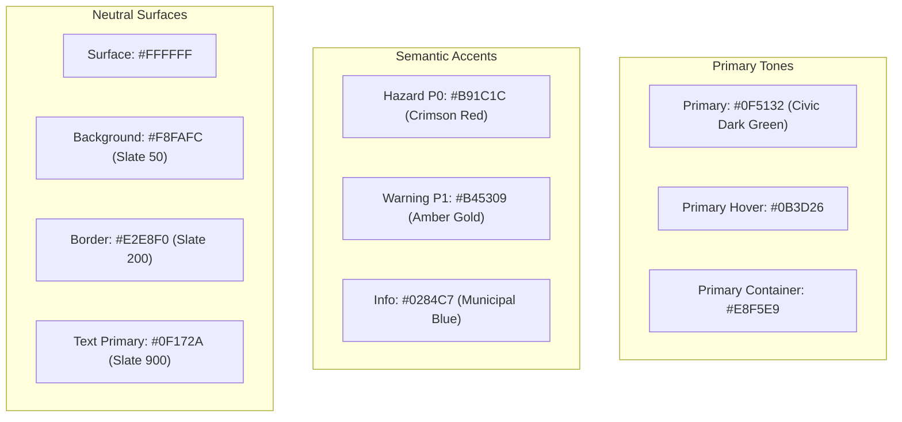

# UI Design System & Component Specification

**Project:** CWA Ship Karachi 2026 — Karachi Civic AI Engine  
**Component:** Frontend UI System (`frontend/`)  
**Design Basis:** Material Design 3 (MD3) + Tailwind CSS + Karachi Civic Trust Palette  
**Governance:** Aligned with [`docs/skills/ui-guidelines/SKILL.md`](file:///c:/Users/kaaif/Documents/Github/team-venus/docs/skills/ui-guidelines/SKILL.md), [`frontend/Team Venus — UI Style Guide.md`](file:///c:/Users/kaaif/Documents/Github/team-venus/frontend/Team%20Venus%20%E2%80%94%20UI%20Style%20Guide.md), and [`docs/ux-specification.md`](file:///c:/Users/kaaif/Documents/Github/team-venus/docs/ux-specification.md)

---

## 1. Design System Foundations

### 1.1 Emotional Direction: Civic Trust & Executive Utility
The interface addresses two distinct operational environments using a unified design language:
- **Citizen Experience:** Calm, authoritative, and deeply reassuring. High clarity, uncluttered surfaces, and an empathetic green-and-slate palette that inspires institutional confidence.
- **Official Experience:** High-density, zero-distraction utility. Clear tabular hierarchy, immediate photo evidence scanning, and rapid emergency triage indicators.

### 1.2 The Strict 4px Spacing Scale
All margins, paddings, and layout gaps must derive strictly from the 4px baseline unit. Arbitrary values (e.g., `p-[13px]`) are prohibited.

| Scale Token | Pixel Value | Tailwind Utility | Common Application |
|---|---|---|---|
| `1` | 4px | `p-1`, `gap-1`, `m-1` | Badge padding, tight icon spacing |
| `2` | 8px | `p-2`, `gap-2`, `m-2` | Chip padding, inner button element gaps |
| `3` | 12px | `p-3`, `gap-3`, `m-3` | Input field vertical padding, small card padding |
| `4` | 16px | `p-4`, `gap-4`, `m-4` | Standard card body padding, form row spacing |
| `6` | 24px | `p-6`, `gap-6`, `m-6` | Modal container padding, section header gaps |
| `8` | 32px | `p-8`, `gap-8`, `m-8` | Page layout margins, dashboard column spacing |
| `12` | 48px | `p-12`, `gap-12` | Hero container vertical padding |
| `16` | 64px | `p-16`, `gap-16` | Major layout sectional divides |

---

## 2. Typography Hierarchy (Material Design 3 Scale)

Using a clean system sans-serif font stack (`Inter`, `-apple-system`, `BlinkMacSystemFont`, `Segoe UI`, `Roboto`, `sans-serif`):

```
Display Large    32px / 40px  · Bold (700)      · tracking-tight
Headline Medium  24px / 32px  · SemiBold (600)  · tracking-normal
Title Medium     18px / 24px  · Medium (500)    · tracking-normal
Body Large       16px / 24px  · Regular (400)   · text-slate-800
Body Medium      14px / 20px  · Regular (400)   · text-slate-600
Label Small      12px / 16px  · Medium (500)    · uppercase tracking-wider text-slate-500
```

| Type Role | Font Size / Line Height | Font Weight | Tailwind Classes | Usage |
|---|---|---|---|---|
| **Display** | 32px / 40px | Bold | `text-3xl font-bold tracking-tight text-slate-900` | Landing Page & Portal Hero Titles |
| **Headline** | 24px / 32px | SemiBold | `text-2xl font-semibold text-slate-900` | Section Headings, Modal Titles |
| **Title** | 18px / 24px | Medium | `text-lg font-medium text-slate-900` | Card Titles, Metric Card Headings |
| **Body Large** | 16px / 24px | Regular | `text-base text-slate-700 leading-relaxed` | Citizen Layman Summary, Complaint Text |
| **Body Medium**| 14px / 20px | Regular | `text-sm text-slate-600 leading-normal` | Table Rows, Field Descriptions, Notes |
| **Label** | 12px / 16px | Medium | `text-xs font-semibold uppercase tracking-wider` | Badges, Department Tags, Severity Pills |

---

## 3. Semantic Color Palette & Tokens

No raw hex codes in component templates. Everything maps to semantic roles:



### 3.1 Color Token Mapping Table

| Semantic Role | Hex Value | Tailwind Variable / Class | Context / Purpose |
|---|---|---|---|
| **`primary`** | `#0F5132` | `bg-emerald-900` / `text-emerald-900` | Primary buttons, active brand headers, official crests |
| **`primary-hover`** | `#0B3D26` | `hover:bg-emerald-950` | Button interactive hover state |
| **`primary-container`**| `#DCFCE7` | `bg-emerald-50` / `text-emerald-900` | Layman summary highlight boxes, confirmed cards |
| **`secondary`** | `#0284C7` | `bg-sky-600` / `text-sky-600` | Secondary links, GPS location active button |
| **`surface`** | `#FFFFFF` | `bg-white` | Card backgrounds, modal containers, inputs |
| **`surface-variant`**| `#F1F5F9` | `bg-slate-100` | Table headers, secondary toolbars, disabled surfaces |
| **`background`** | `#F8FAFC` | `bg-slate-50` | Main application background |
| **`border`** | `#E2E8F0` | `border-slate-200` | Subtle M3 structural borders |
| **`error` / `P0`** | `#B91C1C` | `bg-red-700` / `text-red-700` | P0 Critical emergency hazard pill, destructive alerts |
| **`error-container`** | `#FEE2E2` | `bg-red-50` / `text-red-800` | P0 warning badges, validation error callouts |
| **`warning` / `P1`** | `#B45309` | `bg-amber-700` / `text-amber-700`| P1 Major disruption pill, `PENDING` status pill |
| **`warning-container`**| `#FEF3C7`| `bg-amber-50` / `text-amber-900`| Pending notification badges, landmark warning alerts |
| **`success`** | `#15803D` | `bg-green-700` / `text-green-700` | `RESOLVED` status pill, checkmark badges |
| **`success-container`**| `#DCFCE7`| `bg-green-50` / `text-green-900` | Verification card background, copy confirmed badge |

---

## 4. Component States & Implementation Rules

Every interactive element must implement all 6 interactive states:

```
Default  ·  Hover  ·  Active/Focused  ·  Disabled  ·  Loading  ·  Error
```

### 4.1 Buttons
Maximum of two button styles per screen (one Primary, one Secondary/Ghost):

```html
<!-- Primary Button (Filled) -->
<button class="h-11 px-6 bg-emerald-900 text-white font-medium text-sm rounded-lg
               hover:bg-emerald-950 active:bg-black focus:outline-none focus:ring-2 
               focus:ring-emerald-700 focus:ring-offset-2 disabled:bg-slate-200 
               disabled:text-slate-400 disabled:cursor-not-allowed transition-colors duration-150">
  Confirm & File Grievance
</button>

<!-- Secondary / Ghost Button -->
<button class="h-11 px-6 bg-transparent text-slate-700 font-medium text-sm rounded-lg
               border border-slate-300 hover:bg-slate-100 active:bg-slate-200
               focus:outline-none focus:ring-2 focus:ring-slate-400 focus:ring-offset-2
               disabled:text-slate-300 disabled:border-slate-200 transition-colors duration-150">
  Make Changes
</button>
```

### 4.2 Text Inputs & Textareas
- Height: Minimum `44px` (`h-11`) for tap accessibility.
- Default: `border-slate-300 bg-white text-slate-900`.
- Focus: `ring-2 ring-emerald-700 border-emerald-700 outline-none`.
- Error: `border-red-600 ring-1 ring-red-600 bg-red-50/20`.
- Inline Error Message: `text-xs text-red-600 mt-1 font-medium`.

### 4.3 Severity & Status Badges (Pills)
Strictly standardized for immediate recognition:

| Badge Type | Text / Role | Visual Classes |
|---|---|---|
| **Severity P0** | `🚨 P0 EMERGENCY` | `px-2.5 py-1 text-xs font-semibold rounded-full bg-red-100 text-red-800 border border-red-200` |
| **Severity P1** | `⚠️ P1 MAJOR` | `px-2.5 py-1 text-xs font-semibold rounded-full bg-amber-100 text-amber-900 border border-amber-200` |
| **Severity P2** | `ℹ️ P2 ROUTINE` | `px-2.5 py-1 text-xs font-semibold rounded-full bg-slate-100 text-slate-700 border border-slate-200` |
| **Status: PENDING** | `⏳ PENDING ACTION` | `px-2.5 py-1 text-xs font-semibold rounded-full bg-amber-100 text-amber-900 border border-amber-300` |
| **Status: IN PROGRESS**| `🛠️ IN PROGRESS` | `px-2.5 py-1 text-xs font-semibold rounded-full bg-sky-100 text-sky-900 border border-sky-300` |
| **Status: RESOLVED** | `✅ RESOLVED` | `px-2.5 py-1 text-xs font-semibold rounded-full bg-green-100 text-green-900 border border-green-300` |

---

## 5. Screen-by-Screen UI Specifications

### 5.1 Dual-Portal Login (`/login`)
- **Container:** Centered max-width `440px` card, elevated with `shadow-sm border border-slate-200 bg-white rounded-xl p-6 sm:p-8`.
- **Branding Header:**
  - Karachi Civic AI crest / icon in `#0F5132`.
  - Title: `text-2xl font-bold text-slate-900`, Subtitle: `text-sm text-slate-500 mt-1`.
- **Tab Segmented Switcher:**
  - 2-item toggle pill (`Citizen Access` vs `Official Portal`).
  - Active Tab: `bg-emerald-900 text-white shadow-xs rounded-lg py-2 text-sm font-medium`.
  - Inactive Tab: `text-slate-600 hover:text-slate-900 py-2 text-sm font-medium`.
- **Input Fields:**
  - Citizen: CNIC input with auto-formatting `42101-XXXXXXX-X`.
  - Password input with toggle show/hide icon.
- **Demo Switcher Bar (Hackathon Convenience):**
  - Section title: `text-xs font-semibold uppercase tracking-wider text-slate-400 mt-6 mb-2`.
  - 4 quick-select chips: `[Citizen Demo]`, `[KW&SC SDO]`, `[KMC Officer]`, `[Super Admin]`.
  - Clicking any chip pre-fills credentials and displays role pill.

---

### 5.2 Citizen Grievance Intake Card (`/citizen/portal`)
- **Layout:** Max-width `720px` centered column.
- **Card Styling:** `bg-white border border-slate-200 rounded-xl p-6 sm:p-8 shadow-sm`.
- **Section 1: Multimodal Problem Description:**
  - Textarea: `min-h-[120px] p-3 text-base border border-slate-300 rounded-lg focus:ring-2 focus:ring-emerald-700`.
  - Multilingual placeholder: *"Apna masla bayan karein (English, اردو, ya Roman Urdu me)... maslan: Gulshan Block 4 me sewer line ubal rahi hai"*
- **Section 2: Media Uploader Grid (2 Columns):**
  - **Left: Photo Drag & Drop:**
    - Dashed container: `border-2 border-dashed border-slate-300 rounded-lg p-4 text-center hover:border-emerald-700 hover:bg-emerald-50/20 cursor-pointer`.
    - Thumbnail preview upon file selection with remove `(×)` icon.
  - **Right: 1-Tap Voice Note Recorder:**
    - Mic button: `h-12 w-12 rounded-full bg-emerald-100 text-emerald-800 hover:bg-emerald-200 flex items-center justify-center`.
    - Active recording state: Red pulsing ring `animate-pulse`, live timer `00:14`, and stop button.
    - Playback audio player after recording.
- **Section 3: Location & Landmark:**
  - Location Row:
    - Left: Button `[📍 Auto-Detect GPS]` (`h-10 px-3 text-xs font-medium border border-sky-300 bg-sky-50 text-sky-800 rounded-lg`).
    - Right: Input field *"Landmark / Mashhoor Jagah (e.g. Near Disco Bakery)"*.
- **Primary CTA:**
  - `w-full h-12 bg-emerald-900 text-white font-semibold text-base rounded-lg shadow-sm hover:bg-emerald-950 mt-6`.
  - Loading State: Spinner with micro-copy: *"Karachi Civic AI Engine is reading your grievance..."*.

---

### 5.3 Human-in-the-Loop Review Modal (`ReviewModal`)
- **Container:** Modal dialog overlay `bg-slate-900/50 backdrop-blur-xs`, content container `max-w-xl w-full bg-white rounded-2xl shadow-xl p-6 border border-slate-200`.
- **Header:**
  - Authority Badge: `🏛️ KW&SC (Karachi Water & Sewerage Corporation)`.
  - Severity Badge: `🚨 P0 EMERGENCY PUBLIC HEALTH HAZARD`.
- **Community Clustering Banner:**
  - `bg-emerald-50 border border-emerald-200 rounded-lg p-3 text-xs text-emerald-900 font-medium flex items-center gap-2`.
  - Content: `👥 3 neighbors in Gulshan Block 4 have also reported this issue. Your complaint will be stacked to increase collective urgency.`
- **Citizen Layman Summary (The Hero Box):**
  - `bg-slate-50 border-l-4 border-emerald-800 rounded-r-lg p-4 my-4`.
  - Text: `text-slate-800 text-sm leading-relaxed`.
  - Example: *"Humne aapki shikayat ka jaiza lia hai. Yeh masla KW&SC ke daera-e-ikhtiyar me ata hai. Gutter ke gande pani se bimariyan phailne ka khatra hai, is liye ise P0 Emergency ke tor par mark kia gaya hai."*
- **Progressive Disclosure Accordion:**
  - Summary link: `text-xs text-emerald-800 font-medium hover:underline flex items-center gap-1`.
  - Expanded content: Tabbed view of English Statutory Draft and Urdu Official Notice.
- **Action Bar:**
  - Primary: `[Confirm & File Official Grievance]` (`bg-emerald-900 text-white h-11 px-6 rounded-lg font-medium text-sm flex-1`).
  - Secondary: `[Make Changes]` (`border border-slate-300 text-slate-700 h-11 px-4 rounded-lg text-sm`).

---

### 5.4 Verified Tracking ID Card (`SuccessCard`)
- **Container:** `max-w-md w-full bg-white border border-emerald-200 rounded-xl p-6 text-center shadow-sm mx-auto`.
- **Success Icon:** Green checkmark in animated circular container (`h-14 w-14 bg-emerald-100 text-emerald-700 rounded-full mx-auto`).
- **Tracking Number Display:**
  - Label: `text-xs font-semibold uppercase tracking-wider text-slate-500 mt-3`.
  - Tracking ID: `text-2xl font-mono font-bold text-slate-900 tracking-wider my-1`.
  - 1-Tap Copy Button: `inline-flex items-center gap-1 text-xs text-emerald-800 font-medium hover:text-emerald-950 mt-1`.
- **Routing Confirmation Box:**
  - `bg-slate-50 rounded-lg p-3 my-4 text-left border border-slate-200`.
  - `text-xs text-slate-600`: *"Assigned Department: **KW&SC** · Status: **Pending Official Action**"*.
- **Primary CTA:**
  - `[Report Another Grievance]` (`w-full h-11 bg-emerald-900 text-white rounded-lg font-medium text-sm hover:bg-emerald-950`).

---

### 5.5 Government Official Scoped Dashboard (`/admin/dashboard`)
- **Header Banner:**
  - Full-width container: `bg-white border-b border-slate-200 px-6 py-4 flex items-center justify-between`.
  - Left: Department Crest + `text-lg font-bold text-slate-900` (*"Karachi Water & Sewerage Corporation — Central Operations"*).
  - Right: Official Name + Role Pill + Logout button.
- **Triage KPI Metrics Row (4 Cards Grid):**
  - Grid: `grid grid-cols-2 lg:grid-cols-4 gap-4 mb-6`.
  - Card: `bg-white border border-slate-200 rounded-xl p-4 shadow-xs`.
  - Content: Title (`text-xs font-medium text-slate-500 uppercase`), Value (`text-2xl font-bold text-slate-900 mt-1`), Subtext.
  - Card 4 (P0 Emergency) highlighted with `border-l-4 border-l-red-600 bg-red-50/20`.
- **Scoped Complaints Table:**
  - Clean M3 tabular data view:
    - Columns: `Tracking ID`, `Category & Severity`, `Landmark`, `Community Impact`, `Evidence`, `Status`, `Action`.
    - Hover row: `hover:bg-slate-50/80 transition-colors duration-100`.
    - Evidence Thumbnail: `h-10 w-10 rounded-md object-cover border border-slate-200 cursor-pointer`.
    - Action CTA: `[Open Dossier]` (`h-8 px-3 text-xs font-semibold bg-slate-900 text-white rounded-md hover:bg-black`).

---

### 5.6 Incident Dossier Modal (`DossierModal`)
- **Container:** `max-w-4xl w-full bg-white rounded-2xl shadow-2xl p-6 border border-slate-200`.
- **2-Column Layout (`grid grid-cols-1 md:grid-cols-12 gap-6`):**
  - **Left (5 Cols) — Physical Evidence & Impact:**
    - High-res evidence photo viewer with zoom preview.
    - Landmark & GPS coordinates box.
    - Community Citizens List (masked CNICs: `42101-*******-1`).
  - **Right (7 Cols) — Legal Mandate & Action:**
    - Statutory Citations Callout (`KW&SC Act 2023 Sec. 24, Constitution Arts. 9 & 14`).
    - Bilingual Segmented Tab (`English Statutory Grievance` vs `Urdu Formal Notice`).
    - Text container: `bg-slate-50 p-3 rounded-lg border border-slate-200 max-h-[160px] overflow-y-auto text-xs font-mono`.
    - **Status Transition Action Form:**
      - Dropdown: `[PENDING | IN_PROGRESS | RESOLVED]`.
      - Official Notes Input: Textarea (`h-20 text-xs border-slate-300 rounded-md p-2`).
      - Primary CTA: `[Save Status Update & Dispatch]` (`w-full h-10 bg-emerald-900 text-white font-medium text-xs rounded-lg`).

---

## 6. Tailwind Configuration Specifications

Configure `frontend/tailwind.config.js`:

```javascript
/** @type {import('tailwindcss').Config} */
export default {
  content: [
    "./index.html",
    "./src/**/*.{js,ts,jsx,tsx}",
  ],
  theme: {
    extend: {
      colors: {
        emerald: {
          900: '#0F5132',
          950: '#0B3D26',
        },
      },
      spacing: {
        '1': '4px',
        '2': '8px',
        '3': '12px',
        '4': '16px',
        '6': '24px',
        '8': '32px',
        '12': '48px',
        '16': '64px',
      },
      borderRadius: {
        'xl': '12px',
        '2xl': '16px',
      },
      transitionDuration: {
        DEFAULT: '150ms',
      }
    },
  },
  plugins: [],
}
```

---

## 7. Accessibility & Mobile Standards

- **Target Tap Size:** All buttons, file dropzones, and inputs exceed `44×44px` touch footprint.
- **Contrast:** Text colors guarantee minimum `4.5:1` contrast ratio against backgrounds (`slate-900` on `white` is `16:1`; `emerald-900` on `white` is `7.8:1`).
- **Visible Focus Indicator:** All interactive elements use `focus:ring-2 focus:ring-emerald-700 focus:ring-offset-2`.
- **Transitions:** Hard cap at `<= 150ms` (no sluggish decorative animations).
