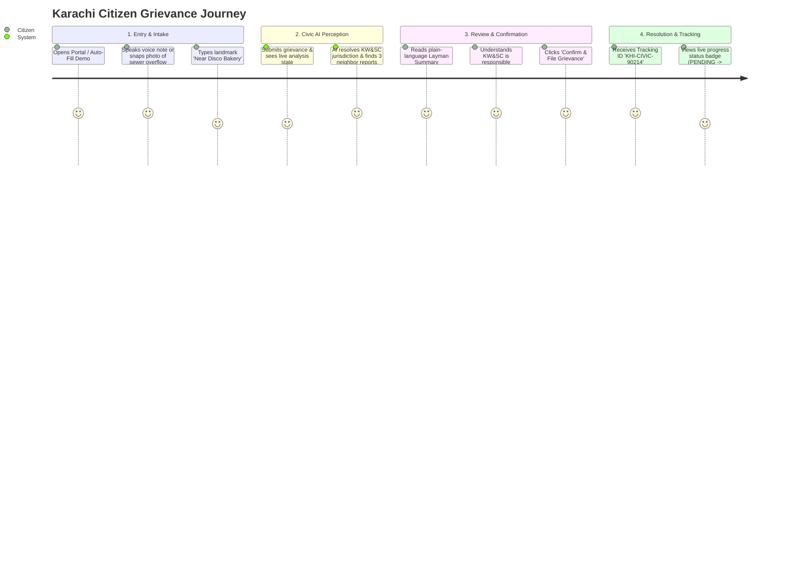

# Karachi Civic UX Specification & Journey Architecture

**Project:** CWA Ship Karachi 2026 — Karachi Civic AI Engine  
**Component:** Frontend UX Architecture & Interaction Flows  
**Target Audience:** Citizens of Karachi & Karachi Municipal Officials (KW&SC, KMC, SSWMB, Cantonments)  
**Governance:** Aligned with [`docs/skills/ux-guidelines/SKILL.md`](file:///c:/Users/kaaif/Documents/Github/team-venus/docs/skills/ux-guidelines/SKILL.md) and [`docs/components/frontend.md`](file:///c:/Users/kaaif/Documents/Github/team-venus/docs/components/frontend.md)

---

## 1. Karachi Context & Cultural User Realities

Designing for Karachi demands recognizing unique sociotechnical constraints and behavioral habits:

### 1.1 Linguistic Realities: The Trilingual Mix
- Most citizens express urgent civic issues in **Roman Urdu** (*"hmaray block me do din se gutter ubal raha hai aur smell arhi hai"*), **Urdu script** (*"گٹر ابل رہا ہے"*), or conversational English.
- Heavy bureaucratic English legalese (*"Grievance redressal pursuant to Sec. 24 of Act..."*) alienates ordinary citizens.
- **UX Requirement:** The intake interface must accept any language naturally, and the review loop must present an empathetic, conversational **Layman Summary** in plain Urdu and English before generating formal legal dossiers for authorities.

### 1.2 Cognitive Fatigue & System Distrust
- Karachi residents suffer from acute **bureaucratic ping-pong** (*"chakar lagana"*): KMC claims it is a Water Board problem; the Water Board claims it is Cantonment territory; Cantonment claims it is a provincial road.
- **UX Requirement:** The system must immediately eliminate ambiguity by answering the citizen's core question: **"Who is legally responsible for fixing this?"** and proving **"I am not alone"** by displaying community clustering (*"3 neighbors have also reported this"*).

### 1.3 Navigational Mental Models: Landmark over Coordinates
- Karachiites rarely navigate by postal codes or formal street numbers. Directions are landmark-based (*"Near Disco Bakery"*, *"Behind Dolmen Mall"*, *"Opposite Chase Up"*, *"KDA Flat ground ke samnay"*).
- **UX Requirement:** GPS auto-detect is a 1-click convenience, but the **Landmark Input** must be a prominent, first-class citizen with helpful auto-hints.

### 1.4 Digital Accessibility & Multimodal Reliance
- Typing detailed paragraphs on mobile touchscreens is a major friction point.
- Voice notes are the default communication medium in Karachi (dominant via WhatsApp).
- **UX Requirement:** Audio voice note recording (1-tap mic) and photo capture must be co-equal with text.

---

## 2. Core User Personas

| Dimension | Citizen Persona: **Farhan** (Gulshan-e-Iqbal Resident) | Government Official: **Engr. Tariq Aziz** (KW&SC SDO) |
|---|---|---|
| **Role & Context** | Resident / Local Shopkeeper facing raw sewage outside his store. | Sub-Divisional Officer overseeing water and sewerage maintenance in District East. |
| **Primary Goal** | Get the sewage drained without visiting offices or paying bribes. Wants accountability. | Quickly triage emergencies, view photo evidence, dispatch repair crews, and record progress. |
| **Pain Points** | Doesn't know whether KMC or KW&SC owns the line; exhausted by ignored complaints. | Overwhelmed with unverified complaints; lacks exact location and photo proof. |
| **UX Need** | Instant voice/photo filing, plain-language validation, verifiable tracking ID. | High-density triage table, emergency P0 hazards highlighted, 1-click status update with notes. |

---

## 3. The Primary User Journey (The North Star)

> **"A Karachi citizen reports an acute civic breakdown in under 60 seconds using voice, photo, or Roman Urdu text, immediately learns which municipal body is legally accountable through an empathetic layman summary, and receives an official tracking ID with collective community weight."**

---

## 4. Screen-by-Screen Journey Architecture

### Screen 1: Dual-Portal Authentication (`/login`)
- **Purpose:** Seamless entry for both citizens and municipal officers with zero onboarding friction.
- **Karachi-Specific Touch:**
  - Citizen login supports Pakistani National Identity Card (**CNIC**) format with automatic hyphen masking (`42XXX-XXXXXXX-X`) or phone number (`03XXXXXXXXX`).
  - One-click **Demo Persona Switcher** for hackathon evaluators (*"Citizen Demo"*, *"KW&SC Officer"*, *"KMC Officer"*, *"Super Admin"*).
- **Single Primary Action:** **`Log In`** (Citizen or Official).
- **Secondary Action:** *"New Citizen? Register with CNIC"* or *"Link WhatsApp Number"*.

---

### Screen 2: Citizen Grievance Intake (`/citizen/portal`)
- **Purpose:** Enable any citizen—regardless of tech literacy—to report a civic failure in under 30 seconds.
- **Layout & Interaction Elements:**
  1. **Multimodal Input Hub:**
     - **Voice Note Recorder:** Prominent microphone button. Tap to record voice message in Urdu/Sindhi/English. Waveform indicator and playback scrubber.
     - **Photo Dropzone:** Snaps or uploads picture with thumbnail preview and instant delete option.
     - **Text Box:** Multilingual placeholder: *"Apna masla bayan karein (English, اردو, ya Roman Urdu me)... maslan: Gulshan Block 4 me gutter ubal raha hai"*.
  2. **Location & Landmark Hub:**
     - **"📍 Use My Current Location"** button: One-tap browser geolocation.
     - **Landmark Field:** Explicit input: *"Mashhoor Jagah / Landmark (e.g. Near Disco Bakery, NIPA Chowrangi, Matric Board Office)"*.
- **Single Primary Action:** **`Analyze Grievance with Civic AI`** (Full-width button with civic green fill).
- **Feedback State:** During upload, transitions button to loading spinner: *"Karachi Civic AI Engine is reading your report..."*

---

### Screen 3: Human-in-the-Loop Review Modal (`ReviewModal`)
- **Purpose:** Build trust through transparency. Present AI classification, identified department, and a human-readable explanation **before** official submission.
- **Layout & Visual Hierarchy:**
  1. **Jurisdiction & Severity Header:**
     - Authority Tag: `🏛️ KW&SC (Karachi Water & Sewerage Corporation)`
     - Severity Pill: `🚨 P0 - Emergency Public Health Hazard`
  2. **Collective Community Clout Callout:**
     - Banner: `👥 3 Other Neighbors in Gulshan Block 4 Have Reported This Problem`
     - Text: *"Your report will be clustered with existing community reports to demand immediate priority."*
  3. **The Layman Summary (Citizen-Facing Hero Box):**
     - Emphasized callout card in conversational language:
       > *"Humne aapki shikayat ka jaiza lia hai. Yeh masla KW&SC ke daera-e-ikhtiyar me ata hai. Gutter ke gande pani se bimariyan phailne ka khatra hai, is liye ise P0 Emergency ke tor par register kia ja raha hai."*
  4. **Progressive Disclosure Accordion:**
     - Link: *"📄 View Official Statutory Legal Draft (English / Urdu)"*
     - Expands to show formal complaint text with legal citations (*KW&SC Act 2023 Sec. 24, Constitution Arts. 9 & 14*) so the citizen knows the complaint has statutory teeth.
- **Single Primary Action:** **`Confirm & File Official Grievance`** (Solid green button).
- **Secondary Action:** *"Make Changes / Add Details"* (Ghost button).

---

### Screen 4: Verified Tracking ID & Proof of Filing (Immediate Success State)
> [!NOTE]
> **MVP Scope Boundary:** To minimize backend dependencies and maintain simplicity, Screen 4 focuses strictly on the immediate verified **Tracking ID Success Card**. Historical "My Grievances" list querying is deferred for post-hackathon, so no additional backend query work is required.

- **Purpose:** Eliminate citizen anxiety by providing immediate, undeniable proof of filing with a copyable tracking number.
- **Layout & Visual Hierarchy:**
  1. **Success Confirmation Card (Hero Banner):**
     - Large success checkmark badge.
     - Prominent tracking badge: **`KHI-CIVIC-90214`** with a 1-tap copy button.
     - Assigned Authority Confirmation: *"Your complaint has been formally registered and routed to the **Karachi Water & Sewerage Corporation (KW&SC)**."*
     - Status Indicator: `PENDING OFFICIAL ACTION` (Amber pill).
     - Next Steps Note: *"Your grievance is stacked in the department dispatch queue. You can use this Tracking ID for follow-ups."*
- **Single Primary Action:** **`Report Another Incident`** (Resets intake form for a new submission).

---

### Screen 5: Government Official Scoped Command Center (`/admin/dashboard`)
- **Purpose:** Empower department officers (e.g. KW&SC Executive Engineers) to triage and resolve complaints within their jurisdiction with zero visual clutter.
- **Layout & Interaction Elements:**
  1. **Department Identity Banner:**
     - Header clearly confirms jurisdiction: *"Karachi Water & Sewerage Corporation (KW&SC) — District East Sub-Division"*.
  2. **Triage Metrics Row (4 Cards):**
     - `Active Incident Clusters`
     - `Pending Official Action`
     - `Crews Dispatched / In Progress`
     - `P0 Critical Hazards`
  3. **Complaints Feed Table:**
     - Columns: Tracking ID, Severity (`P0 Hazard`), Category (`Sewerage`), Landmark (`Near Disco Bakery`), Community Clout (`4 Citizens`), Evidence Thumbnail, Status.
     - Filters: Quick-switch between `P0 Critical Only`, `Pending Only`, `In Progress`.
- **Single Primary Action per Row:** **`Open Dossier`** (Launches full inspection modal).

---

### Screen 6: Government Incident Dossier Modal (`DossierModal`)
- **Purpose:** Provide the official with all necessary legal and physical evidence to act immediately.
- **Layout & Interaction Elements:**
  1. **Evidence & Location Column (Left):**
     - High-resolution photo gallery with zoom capability.
     - Landmark and coordinates.
     - List of co-reporting citizens (masked CNICs for privacy: `42101-*******-1`).
  2. **Statutory Complaint & Actions Column (Right):**
     - Citations Box: Highlights legal mandates under provincial acts and the Constitution.
     - Bilingual Legal Tabs:
       - **English Statutory Notice:** Formal legal grievance text.
       - **Urdu Departmental Memo:** Standard government Urdu draft (*بخدمت جناب چیف انجینئر صاحب...*).
  3. **Operational Update Bar:**
     - Status Selector: `PENDING` $\rightarrow$ `IN_PROGRESS` $\rightarrow$ `RESOLVED`.
     - Official Field Notes: Textarea for dispatch logs (*"Sub-engineer Farooq dispatched tanker suction pump crew"*).
- **Single Primary Action:** **`Update Official Status & Save Notes`**.
- **Secondary Action:** *"Close Dossier"*.

---

## 5. Ruthless Step-Pruning & UX Friction Audit

To adhere to the principle: *"Does this get the user to their goal faster and more clearly?"*, multiple conventional steps were pruned:

| Typical Civic App Friction | How We Pruned It in Karachi Civic AI | Clicks Saved |
|---|---|---|
| **Manual Department Selector** (*"Select from 12 agencies: KMC, TMC, KW&SC, CBC, KDA..."*) | **100% Automated by AI.** The user describes the problem; AI routes between Cantonment, KMC major roads, and Utilities automatically. | 3 clicks + 0 citizen confusion |
| **Mandatory GPS Pin Drop** | **Optional.** If GPS is blocked or inaccurate, user types a known landmark in plain words. | 2 clicks + eliminated map freezing |
| **Multi-page Wizard** (Step 1: Category $\rightarrow$ Step 2: Location $\rightarrow$ Step 3: Details $\rightarrow$ Step 4: Photo) | **Single unified intake card.** All inputs co-exist on one screen. Submit once. | 4 transitions eliminated |
| **Manual Formal Complaint Drafting** | **AI generates formal bilingual legal draft automatically.** Citizen only reviews the plain-language Layman Summary. | 15 minutes of drafting eliminated |
| **Department Disclaimers & Jargon** | Demoted to progressive disclosure accordions. Never blocks primary review. | 0 cognitive clutter |

---

## 6. Interaction States & Karachi-Tailored Micro-Copy

Every interactive component implements all 4 data-driven states:

### 6.1 Loading States
- **Intake Submit:** Shimmer skeleton with reassuring Urdu/English micro-copy:
  - *"Identifying responsible municipal department (KW&SC / KMC / SSWMB)..."*
  - *"Checking nearby community reports for deduplication..."*
- **Dashboard Data Fetching:** Table skeleton loader; never blank white screens.

### 6.2 Empty States
- **Citizen Portal (No Grievances Yet):**
  - Icon: Clean civic shield illustration.
  - Heading: *"No active grievances filed yet."*
  - Subtext: *"Notice a broken sewer line, road hazard, or overflowing trash in your area? Report it above to hold authorities accountable."*
- **Official Dashboard (All Complaints Cleared):**
  - Icon: Checkmark badge.
  - Heading: *"All departmental complaints in this category have been resolved."*

### 6.3 Error Recovery & Edge Cases
- **No Internet / Network Failure:**
  - *"Connection lost. Your complaint draft is safely stored in your browser. Tap 'Retry' once reconnected."*
- **Ambiguous Landmark / Missing Details:**
  - Actionable prompt: *"We couldn't pinpoint the exact street. Please add a nearby school, market, or hospital name."*
- **Audio Recording Permission Denied:**
  - Friendly fallback: *"Microphone access was blocked. You can write your complaint in the box above or upload an audio file directly."*

---

## 7. Definition of Done (UX Review Checklist)

- [x] **Primary Journey Speed:** A citizen can submit a grievance via voice/photo/text in $< 60$ seconds.
- [x] **One Primary CTA per Screen:** Every screen features exactly one clear primary button with high visual prominence.
- [x] **Karachi Linguistic Compatibility:** Inputs and layman summaries seamlessly handle Roman Urdu, Urdu script, and conversational English.
- [x] **Zero Bureaucratic Ambiguity:** Review modal explicitly shows the assigned agency (`KWSC`, `KMC`, `SSWMB`, `CANTONMENT`) and community report count.
- [x] **Complete State Matrix:** Loading skeletons, populated views, empty states, and error alerts defined for all interactions.
- [x] **Friction Pruning:** Multi-step wizards and manual department selectors eliminated.
